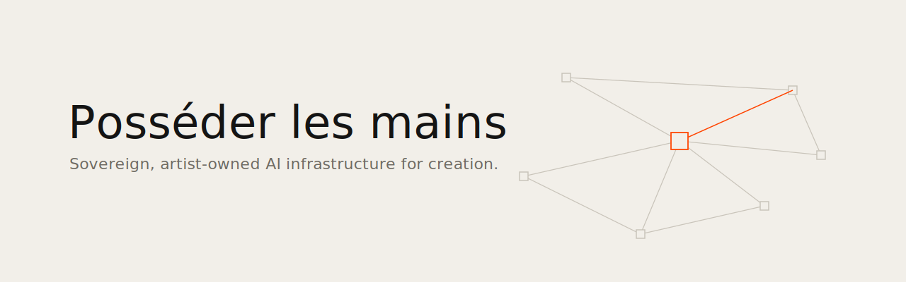
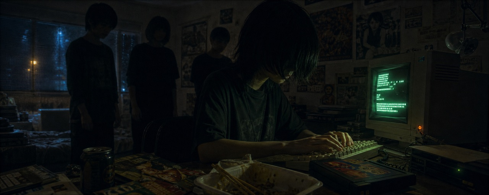

<picture><source media="(prefers-color-scheme: dark)" srcset="banner.svg"></picture>

**English** · [Français](README.fr.md)

# Own the hands, rent the brain

*« Posséder les mains, louer le cerveau »*

*A manifesto for sovereign infrastructures of creation with artificial intelligence.*

I build technical systems for places where artists create with AI. This text comes from the field: it formalizes what I am putting in place for two artist residencies supported by the CNC, the French national film board (the call [« Accompagner les créateurs dans des usages exploratoires des IAG »](https://www.cnc.fr/professionnels/actualites/quatre-structures-laureates-de-lappel-a-projets--accompagner-les-createurs-dans-des-usages-exploratoires-des-intelligences-artificielles-generatives-iag_2577815)). The specific choices of those residencies remain their own; what follows is the method, made generic and reusable.

## What you can create depends on what you own

An environment where you can install anything, modify anything, build your own tools, does not offer the same freedom as a closed service where only approved modules are available. The criterion sounds technical; it is in fact artistic. Whoever cannot create their own nodes inside their generation tool does not decide the shape of their gesture: they choose among authorized gestures.

The same criterion applies to content. On commercial generation services, a given model carries its provider's filter identically across every aggregator, and those filters are often strict: perfectly harmless images get refused, and usage policies there rarely protect artistic nudity, the body, documentary violence. The only path without imposed filters is an open model running on a machine you control. For artists, this draws the line between a practice and supervised entertainment.

## Own the hands, rent the brain

Hence the doctrine that organizes everything else. **Own the hands**: image and video generation, training your own styles (LoRA), your data, your workflows, on machines of your own, local, open, measurable. **Rent the brain**: frontier large language models, beyond the reach of any personal machine, paid per use, taken in deliberate doses. And between the two, **rent extra muscle**: compute by the hour, shared, in datacenters chosen for their electricity, with an environment you carry with you (a versioned system image, data kept separate) and can rebuild somewhere else in an hour.

The budget constraint is not the enemy of this ambition: it is its concept. A request budget with a name on it, visible and capped, turns every generation into a decision. You do not endure sobriety, you practice it.

## Ecology without the fable

I am told that compute in France is "low-carbon." True in grams of CO2, and insufficient as a thought. That low-carbon is first and foremost nuclear, and nuclear waste is a pollutant on the scale of civilizations: low-carbon does not mean clean. To my knowledge, there is today no on-demand compute offer in France powered 100% by hydro or solar. The utopia I am working toward is precise: shared compute that never runs idle, powered by real renewables (Norwegian hydro, Icelandic geothermal), its heat recovered, and every hour attributable to the person who used it.

While waiting for the utopia, a discipline: **measure, calculate, estimate, question**. Measure what runs at home (to the watt). Calculate what runs on transparent servers (hours × power draw × the carbon intensity of the location). Estimate what goes through opaque APIs, and publish your assumptions. And formally question the providers who publish nothing: server locations, electricity mix, energy efficiency, CO2e per hour of compute. I write to them. A provider's silence is data, and it weighs on the decision to use them or not.

## The machine must give way to the gesture

You recognize a successful infrastructure by one thing: in the morning, you open it and find exactly what you left the night before. Each person has a folder of their own, present everywhere; everything else is a resettable, versioned system you can break without consequence. The freedom to experiment (destroy everything) and the continuity of the work (never lose anything) are the same architectural decision.

And above the tools, the agents. Here too, two stances: use the existing harnesses, or build your own, one that orchestrates everything (generation, editing, modeling, documents). This is more than comfort: it opens up two ways of creating. One, linear, organizes the work around its documents, undoing and remaking them. The other, systemic, builds the system from which the fiction emerges, generative, potentially endless.

## What I stand for

Places of creation where artists own their digital means of production. Open source by default, proprietary with eyes open. Costs and footprints visible per gesture. Providers who answer the questions they are asked. And rigor as a form of hospitality: a system thought through to the end is what allows someone who has never touched a terminal to create freely from the very first morning.

---

**Read next: [The Field Guide](GUIDE_EN.md).** The generic blueprint: four-brick architecture, network, open software stack, per-person credit caps, carbon method, prerequisites, budget blocks, lessons.

*Ismaël Joffroy Chandoutis, filmmaker and artist.*
*Contact: contact@ismaeljoffroychandoutis.com*
*License: [CC BY-SA 4.0](LICENSE.md) · Cite: [CITATION.cff](CITATION.cff)*
