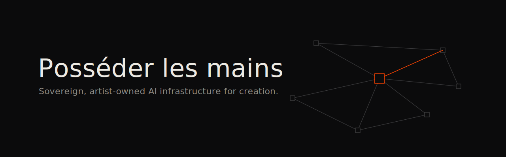

**English** · [Français](README.fr.md)

# Own the hands, rent the brain

Sovereign infrastructures for AI-assisted creation. This repository formalizes a method I build in the field, within two artist residencies supported by the CNC, the French national film board ([IAG call](https://www.cnc.fr/professionnels/actualites/quatre-structures-laureates-de-lappel-a-projets--accompagner-les-createurs-dans-des-usages-exploratoires-des-intelligences-artificielles-generatives-iag_2577815)): giving artists digital means of production they actually own, open source by default, costs and footprints visible per gesture, and a daily experience so simple it disappears.

- **[The Manifesto](MANIFESTO.md)**: the position. The degree of creation depends on what you own; ecology without fairy tales (low-carbon does not mean clean); measure, compute, estimate, question.
- **[The Field Guide](GUIDE_EN.md)**: the generic blueprint. Four-brick architecture, network, open software stack, per-person credit caps, carbon method, prerequisites, budget blocks, lessons.

---

*Ismaël Joffroy Chandoutis, filmmaker and artist.*
*Contact: contact@ismaeljoffroychandoutis.com*
*License: [CC BY-SA 4.0](LICENSE.md)*
